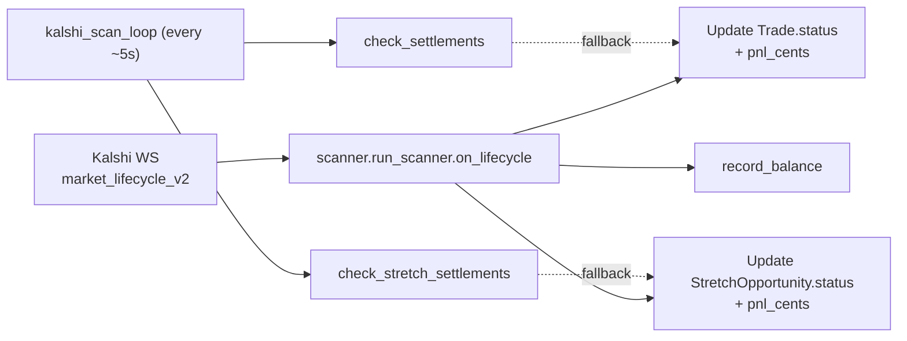

# Architecture

A single-process FastAPI app that hosts both the HTTP API and the market scanner as cooperative asyncio tasks. State is in SQLite. Read-only consumers (dashboard, CLI) talk over HTTPS with Bearer auth. Production durability comes from periodic S3 snapshots.

## Pattern

**Embedded scanner inside the API process.** `src/predictions/api.py::lifespan` (line 216) is a FastAPI lifespan context manager that:

1. Restores the SQLite DB from S3 (`_download_db`).
2. Initializes both DBs (`init_db()` and `init_soccer_db()`).
3. Constructs a `KalshiClient` from `KALSHI_API_KEY` + `KALSHI_PRIVATE_KEY`/`_PATH`.
4. Spawns `_run_scanner_loop()` as `asyncio.create_task(...)` — runs concurrently with the HTTP server in the same event loop.
5. On shutdown, runs `_backup_db_sync()` to flush a final S3 snapshot.

Because the scanner shares the event loop with the HTTP handlers, there are no IPC boundaries: `market_prices` (`scanner.py:798`) is a module-level `dict` directly read by both the scanner's evaluator and the API's `/api/live-games` endpoint.

## Scanner loops

`src/predictions/scanner.py::run_scanner` (line 779) is a single async function that defines four nested coroutines and `asyncio.gather`s them:

| Loop | Cadence | Purpose | Function (in `run_scanner`) |
|---|---|---|---|
| `espn_loop` | 10 s | Refresh ESPN scoreboard, populate `espn_cache` and `espn_final_period_cache` under `espn_lock` | local |
| `kalshi_scan_loop` | ~5 s (configurable) | Pull Kalshi events/markets, subscribe to new tickers via WS, call `scan_kalshi_with_espn`, run settlement reconciliation, record balance | local |
| `ws_loop` | persistent | Maintain `KalshiWebSocket`, dispatch incoming `ticker` and `market_lifecycle_v2` messages to the on-handlers | local |
| `backup_loop` | 30 min | Call `backup_db` to upload a SQLite snapshot to S3 | local (calls `scanner.backup_db`) |

The loops share state via closure-captured locals and module globals:

- `espn_cache`, `espn_final_period_cache` — guarded by `espn_lock`.
- `market_prices` — global dict (`scanner.py:798`), read by `scan_kalshi_with_espn` and `/api/live-games`.
- `subscribed_tickers`, `ticker_sub_sid`, `lifecycle_sub_sid` — closure state for WS subscription bookkeeping.

## Settlement duality

A market settles via two independent paths. The on-WS path is the primary; the REST path is a fallback executed every scan loop in case the WS missed an event.



P&L is computed in two places — `on_lifecycle` (`scanner.py:823-870`) and `check_settlements` / `check_stretch_settlements` (`scanner.py:202`, `scanner.py:707`). Subtle divergence between them is called out in `docs/project.md` Known Issues; relevant when changing fee handling or P&L formula.

## Layers

```
┌────────────────────────────────────────────────────────────┐
│ External: Kalshi REST + WS, ESPN, API-Football, S3        │
└────────────────────┬───────────────────────────────────────┘
                     │
┌────────────────────▼───────────────────────────────────────┐
│ Adapters (single drift point per integration)              │
│  src/predictions/kalshi_client.py   extract_cents/_volume  │
│  src/predictions/espn.py            scoreboard + matching  │
│  src/predictions/soccer_cache.py    API-Football + cache   │
└────────────────────┬───────────────────────────────────────┘
                     │
┌────────────────────▼───────────────────────────────────────┐
│ Domain logic                                               │
│  src/predictions/scanner.py   loops + bet eval + WHAT_IF   │
│  src/predictions/backtest.py  simulate_match, run_backtest │
└────────────────────┬───────────────────────────────────────┘
                     │
┌────────────────────▼───────────────────────────────────────┐
│ Persistence — SQLAlchemy 2 ORM over SQLite                 │
│  src/predictions/db.py         tables + KV config + ALTERs │
│  src/predictions/soccer_cache.py (separate engine + DB)    │
└────────────────────┬───────────────────────────────────────┘
                     │
┌────────────────────▼───────────────────────────────────────┐
│ HTTP boundary                                              │
│  src/predictions/api.py  FastAPI app + Bearer-auth deps    │
└────────────────────┬───────────────────────────────────────┘
                     │
       ┌─────────────┴─────────────┐
       │                           │
┌──────▼─────────┐         ┌───────▼────────────────┐
│ Dashboard      │         │ CLI                    │
│ Next.js 16     │         │ React-ink (cli/)       │
│ dashboard/     │         │ Bearer via env/--token │
│ proxies via    │         └────────────────────────┘
│ /api/[...path] │
└────────────────┘
```

## Key abstractions

Defined in `src/predictions/db.py` (SQLAlchemy declarative `Base`):

- **`Scan`** (line 24): one row per scan-loop iteration; telemetry.
- **`Opportunity`** (line 32): a market that *could* be bet on (passed price + lead + timing filters), regardless of whether a trade was placed. Many ESPN columns added later via `_migrate_add_columns`.
- **`Trade`** (line 62): a placed (or dry-run) order. `status` ∈ `placed`, `filled`, `settled_win`, `settled_loss`, `dry_run`. `pnl_cents` populated at settlement; `fee_cents` set at placement.
- **`StretchOpportunity`** (line 89): shadow / what-if bets under 5 parallel strategies (`scanner.WHAT_IF_STRATEGIES`) plus a "default" near-miss bucket. Same shape as `Opportunity` plus `strategy_set`, `side`, `hypothetical_count`, hypothetical P&L. Continuously backtests parameter relaxations on live data — separate from the historical `/api/backtest/soccer` endpoint.
- **`BalanceSnapshot`** (line 128): point-in-time portfolio cash + position value from Kalshi `/portfolio/balance`.
- **`ConfigEntry`** (line 137): KV runtime config. Re-read every scan loop (~5 s) via `get_config_int(key)` (line 258). Defaults in `_CONFIG_DEFAULTS` (line 217-247).

The soccer backtest cache lives in a **separate** engine + SQLite file (`src/predictions/soccer_cache.py`):

- **`SoccerMatch`** (line 36) and **`SoccerGoal`** (line 52): cached upstream API responses. No S3 backup; ephemeral by design (rebuilds on container start).

## Integer-cents invariant

Internal code never sees Kalshi's dollar-string format. The single boundary is `src/predictions/kalshi_client.py::extract_cents` and `extract_volume`. Everything downstream (DB, scanner, API responses, dashboard, CLI) sees integer cents (0-100). Order placement still takes integer `yes_price`/`no_price` — Kalshi's API is asymmetric on read vs write. **Do not introduce parallel converters.**

## Auth model

- Backend: every endpoint except `GET /` uses `Depends(_check_token)` (`src/predictions/api.py:258`). Token is `os.getenv("API_TOKEN")`. `403` if env unset, `401` on missing/invalid Bearer.
- Dashboard browser session: password-based, hashed cookie (`dashboard/app/actions.ts:9-31`). The browser **never** receives `API_TOKEN`.
- Dashboard ↔ API: every browser request is proxied through `dashboard/app/api/[...path]/route.ts`, which checks the auth cookie (`checkAuth()`) and injects `Authorization: Bearer ${API_TOKEN}` server-side.
- CLI ↔ API: token passed via `API_TOKEN` env or `--token`, sent as Bearer (`cli/src/api.ts`).
- API → Kalshi: RSA-PSS signature header per request (`src/predictions/kalshi_client.py::_sign`).

## Entry points

| Layer | Entry | Spawns / serves |
|---|---|---|
| Dev API | `pnpm dev:api` → `uv run uvicorn predictions.api:app …:8000 --reload` | FastAPI + scanner |
| Dev dashboard | `pnpm dev:dashboard` → `next dev -p 3777` | Next.js |
| Dev SST stack | `pnpm dev` → `sst dev` | Spawns API as a "dev mode" service (`sst.config.ts`: `dev: { command: "pnpm dev:api" }`) |
| Prod container | `Dockerfile` → `uv run uvicorn predictions.api:app --host 0.0.0.0 --port 8000` | ECS Fargate task |
| Dashboard prod | OpenNext via `sst.aws.Nextjs` | Lambda + S3 + CF |
| CLI | `cli/src/index.tsx` (`pnpm cli`) | Renders `<App>` from `cli/src/app.tsx`; routes to config/stats/trades/configSet |

## Critical invariants (must hold during edits)

1. **Integer cents internally.** Convert at `extract_cents`, never elsewhere.
2. **`trading_paused == "true"`** is the kill switch — checked before any order placement (`src/predictions/scanner.py::scan_kalshi_with_espn`).
3. **`DRY_RUN`** is read at process start only. Toggling at runtime won't take effect.
4. **Runtime config** comes from `get_config_int("key")`, not hardcoded constants. Defaults live in `db._CONFIG_DEFAULTS`.
5. **WS is primary, REST poll is the backstop** for settlements. Both compute P&L; keep them in sync if you change either.
6. **`DATABASE_URL` default** is computed from `__file__` in `src/predictions/db.py`, so it lands at the repo root regardless of CWD; production overrides to `/tmp/predictions.db`.
