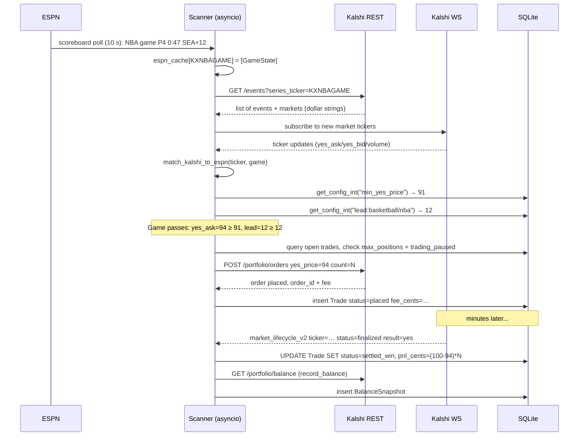

# Kalshi Trading Scanner — Claude guidance

Session rules. Project facts (architecture, conventions, invariants) live in
`.planning/`; this file is the behavioral rulebook plus pointers.

## Where to look for project context

| Question                                                                                                                          | File                                 |
|-----------------------------------------------------------------------------------------------------------------------------------|--------------------------------------|
| What is this project + active milestone, key decisions                                                                            | `.planning/PROJECT.md`               |
| Current phase / progress (what's in flight)                                                                                       | `.planning/STATE.md`                 |
| Phase plans, summaries, reviews, UAT                                                                                              | `.planning/phases/<NN-slug>/`        |
| Stack, dependencies, package managers                                                                                             | `.planning/codebase/STACK.md`        |
| Architecture, scanner loops, settlement duality, **critical invariants** (integer cents, `trading_paused` kill switch, `DRY_RUN`) | `.planning/codebase/ARCHITECTURE.md` |
| Directory layout + "where to put what"                                                                                            | `.planning/codebase/STRUCTURE.md`    |
| Coding style, async patterns, pre-commit, **Don't-do list**                                                                       | `.planning/codebase/CONVENTIONS.md`  |
| External integrations + auth surfaces                                                                                             | `.planning/codebase/INTEGRATIONS.md` |
| Tech debt, fragile invariants, severity-tagged risks                                                                              | `.planning/codebase/CONCERNS.md`     |
| Test layout + coverage gaps                                                                                                       | `.planning/codebase/TESTING.md`      |

`.planning/codebase/*` is regenerated by `/gsd-map-codebase`; check
`last_mapped_commit` in each file's frontmatter for staleness.

## Quick commands

```bash
./install.sh                   # bootstrap (uv + pnpm + .env + hook)
pnpm dev:api                   # API + scanner on :8000
pnpm dev:dashboard             # Dashboard on :3777
pnpm cli config                # TUI (needs API_TOKEN env)
pnpm sst:deploy                # Production deploy
```

## Trading data flow (happy path)



## Verification before claiming done

```bash
uv run ruff check . && uv run ruff format --check . && uv run ty check
(cd dashboard && pnpm lint && pnpm fmt:check && pnpm build)
uv run pytest tests/
```

For backend behaviour changes, also start `pnpm dev:api` and hit the
affected endpoint (`curl http://localhost:8000/` returns
`{"status":"ok"}` when healthy). Don't claim a UI change works without
loading the dashboard in a browser — type checking isn't feature
checking.

## Working relationship

- Be direct and concise. No sycophancy. Challenge assumptions.
- Always prefer the correct fix over the quick one.
- Don't add features, refactoring, or new abstractions beyond what the
  task requires. Don't design for hypothetical future requirements.
- Don't add error handling, fallbacks, or validation for cases that can't
  happen. Trust framework guarantees; validate only at system boundaries.
- Default to writing no comments. Only add one when the WHY is non-obvious.
- When touching shared interfaces (Trade/Opportunity schemas, config keys,
  API endpoints), flag the blast radius and ask before restructuring.

## Autonomy bounds

- Act without asking when the change is reversible, contained to existing
  files, no external side effects, and clearly within the current task.
- Ask before: creating new files, adding/removing dependencies, changing
  shared interfaces, touching CI or infra (`sst.config.ts`, `Dockerfile`).
- When unsure, state the action + intent in one line before doing it.

## Git + commits

- Ask before committing unless the user says otherwise.
- Write clear summary commit messages; prefer multiple logical commits
  over one giant one.
- Never amend pushed commits. Never `--no-verify` hooks unless explicitly
  asked.
- Never commit `.env`, `.env.local`, `predictions.db`, `scanner.log`, or
  anything under `__pycache__/` / `node_modules/` / `.next/` / `.sst/`.
- **Manual secret scan before every commit.** The pre-commit hook
  (`scripts/pre-commit-check.sh`) handles format + type-check only — it
  does NOT scan for secrets (API tokens, Kalshi keys, Cloudflare tokens,
  `BEGIN * PRIVATE KEY`, passwords). If found in staged diff, abort and
  fix.

## Code Intelligence

Prefer LSP over Grep/Glob/Read for navigation:

- `goToDefinition` / `goToImplementation` to jump to source.
- `findReferences` before renaming or changing a signature.
- `workspaceSymbol` / `documentSymbol` / `hover` for discovery.
- Grep/Glob only for text/pattern searches where LSP doesn't help.

After writing or editing code, pause briefly for LSP, then check
diagnostics. Fix type errors and missing imports immediately.
