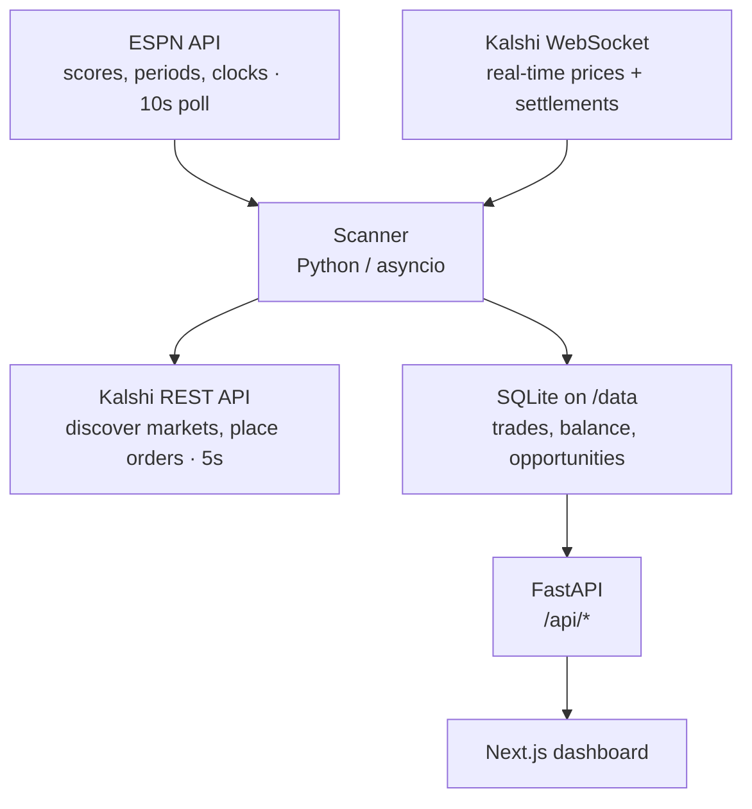

# Kalshi Trading Scanner

Automated scanner that watches live sports games across multiple leagues, cross-references ESPN scores with Kalshi YES contract prices, and buys YES at 88–99¢ on games that are already effectively decided. Settled contracts pay $1; the edge comes from Kalshi's market lag behind live game state.

**Disclaimer.** This software is provided as-is. Prediction markets involve real financial risk and regulatory constraints that vary by jurisdiction. Run in dry-run mode first (the default — see [How to dry-run](#how-to-dry-run)), review every trade placed, and do not deploy with real funds unless you understand the strategy, the risks, and your local regulations.

Ships two ways:

- **Deploy: a Home Assistant add-on** — one container, secrets in the add-on options, SQLite under `/data` and included in HA backups.
- **Develop: local `pnpm`** — the fast inner loop.

---

## Architecture



The scanner runs three concurrent async loops inside a single FastAPI process:

| Loop               | Source      | Cadence   | Purpose                                          |
|--------------------|-------------|-----------|--------------------------------------------------|
| ESPN poll          | ESPN REST   | 10 s      | Live game state (score, period, clock)           |
| Kalshi API scan    | Kalshi REST | 5 s       | Discover markets, evaluate filters, place orders |
| WebSocket listener | Kalshi WS   | real-time | Streaming price ticks + settlement events        |

In the add-on container both processes share one image: uvicorn binds `127.0.0.1:8001`, and the Next.js dashboard on `0.0.0.0:8000` is the only exposed port, proxying `/api/*` to the API server-side.

For deeper architecture detail (scanner loops, settlement duality, integration surfaces), see [`.planning/codebase/ARCHITECTURE.md`](.planning/codebase/ARCHITECTURE.md).

---

## Tech Stack

| Layer     | Tools                                                               |
|-----------|---------------------------------------------------------------------|
| Backend   | Python 3.13, FastAPI, SQLAlchemy 2, SQLite, `asyncio`, `websockets` |
| Dashboard | Next.js 16, React 19, Tailwind CSS 4                                |
| CLI       | React-ink TUI (`cli/`)                                              |
| Tooling   | `uv`, `ruff`, `ty`, `pnpm`, `oxfmt`, `oxlint`                       |
| Deploy    | Home Assistant add-on (Docker, single container)                    |

---

## Deploy: Home Assistant add-on

The add-on runs the scanner and dashboard in a single container, serves the dashboard on port 8000, and stores SQLite + strategies under `/data` (included in HA backups). Dry-run is ON by default and `trading_paused=true` is seeded on first boot — going live takes two deliberate dashboard actions (Go Live, then Resume Trading).

1. **Add the add-on repository.** HA → Settings → Add-ons → Add-on Store → ⋮ → Repositories → paste:

   ```
   https://github.com/petrapa6/kalshi-trading
   ```

2. **Install "Kalshi Trading"** from the repo entry. Supervisor builds the image on-device (first build takes ~5–10 min on a Raspberry Pi).

3. **Configure secrets** in the add-on's Configuration tab:
   - `kalshi_api_key` — from Kalshi
   - `kalshi_private_key` — PEM contents, multi-line
   - `api_token` — generate with `openssl rand -hex 32`
   - `dashboard_password` — login password
   - `api_football_key` — optional, only for the soccer backtest

4. **Start the add-on.** Watch the log for `[kalshi] Seeded trading_paused=true (first boot)` and `[kalshi] next started`, then open `http://homeassistant.local:8000`.

**Updates.** `Settings → Add-ons → Kalshi Trading → ⋮ → Check for updates` pulls the latest commit from `master` and rebuilds. `/data/predictions.db` and `/data/strategies.yaml` survive upgrades.

**Backups.** Everything under `/data` is captured by Home Assistant's own backups — no separate backup step.

**Build the image locally** (add-on parity check):

```bash
docker build -t kalshi-trading:local .
docker run --rm -p 8000:8000 \
    -v "$(pwd)/.haos-smoke-data:/data" \
    --env-file .env \
    kalshi-trading:local
```

`run.sh` falls back to environment variables when `/data/options.json` is absent, which is what makes `--env-file` work outside HA.

---

## Develop: local

### Prerequisites

- [`uv`](https://docs.astral.sh/uv/) (Python package manager)
- [`pnpm`](https://pnpm.io) ≥ 10, Node.js ≥ 20 (required by Next.js 16)
- Docker (optional — only for add-on parity builds)
- A [Kalshi API key + RSA private key](https://kalshi.com/sign-up/api)

### Install

```bash
./install.sh
```

Checks prerequisites, runs `uv sync`, installs JS deps (root + `dashboard/` + `cli/`), copies `.env.example` → `.env` if absent, and installs the pre-commit hook. Idempotent — safe to re-run.

### Run

```bash
pnpm dev:api         # API + scanner on :8000
pnpm dev:dashboard   # dashboard on http://localhost:3777 (separate terminal)
```

### CLI

A React-ink TUI that talks to the API with a Bearer token:

```bash
pnpm cli config                      # show current config (TUI)
pnpm cli config set min_yes_price 90 # update a config key
pnpm cli stats                       # summary stats
pnpm cli trades                      # recent trades
pnpm cli stats --json                # JSON output for scripting
```

Reads `API_TOKEN` and `GETRICH_API_URL` from the environment (or `--token` / `--api-url` flags). Config can also be edited directly against the local DB, with no API round-trip:

```bash
uv run python -m predictions.config_cli                     # show all config
uv run python -m predictions.config_cli set bet_percent 5
uv run python -m predictions.config_cli delete bet_percent  # revert to default
```

### Checks

```bash
uv run ruff format . && uv run ruff check . --fix && uv run ty check
uv run pytest tests/
(cd dashboard && pnpm fmt && pnpm lint)
bash scripts/pre-commit-check.sh   # run the hook manually
```

The WebSocket test auto-skips when `KALSHI_API_KEY` is unset, so the suite runs cleanly without live credentials.

---

## Configuration

Secrets and paths come from environment variables — see [`.env.example`](.env.example) for the canonical list (locally) or the add-on Configuration tab (in HA).

Scanner tuning lives in the SQLite `config` table and is re-read every loop (≈ 5 s), so changes apply without a restart. Initial values come from `src/predictions/db.py::_CONFIG_DEFAULTS`.

**Trading parameters**

| Key                 | Default | Description                                      |
|---------------------|---------|--------------------------------------------------|
| `min_yes_price`     | 91      | Minimum YES ask price in cents to place a bet    |
| `bet_percent`       | 10      | Percentage of available cash to bet per match    |
| `max_positions`     | 20      | Maximum concurrent open positions                |
| `min_volume`        | 50      | Minimum market volume for liquidity              |
| `stretch_price_min` | 85      | Minimum YES price for stretch (shadow) tracking  |
| `trading_paused`    | false   | If `"true"`, the scanner stops placing real bets |

**Per-sport minimum score lead** — keys like `lead:basketball/nba`, `lead:hockey/nhl`. Defaults live in `db.py`: NBA/NCAAMB `12`, NFL/NCAAFB `10`, MLB `3`, NHL/soccer `2`, UFC `0`.

**Per-sport end-of-game timing** — keys like `final_seconds:basketball/nba` (countdown sports: clock ≤ value) or `final_seconds:soccer/eng.1` (count-up sports: clock ≥ value). See `db.py` for defaults.

Update a key over the API:

```bash
curl -X PUT http://homeassistant.local:8000/api/config \
  -H "Authorization: Bearer $API_TOKEN" \
  -H "Content-Type: application/json" \
  -d '{"key": "min_yes_price", "value": "92"}'
```

---

## How to dry-run

Dry-run mode runs the **full live pipeline** — ESPN polling, Kalshi market discovery, WebSocket price ticks, balance reads, and the complete bet-decision logic — but skips the final order placement. Instead of sending an order to Kalshi, the scanner writes the would-be trade to SQLite with status `dry_run` and logs `[DRY RUN] Order not placed`.

Dry-run is a **runtime DB config value** (`dry_run`), toggled from the dashboard — flipping it changes scanner behavior on the next scan tick, no restart. A missing row or any value other than `"false"` means dry-run is ON; only `"false"` enables live trading. Absence is the safe default, so a fresh deploy always starts in dry-run.

> **Note:** dry-run still requires real Kalshi API credentials. Market discovery, prices, and the balance snapshot are all live reads — only order placement is suppressed. There is no fully-offline mode.

Set `KALSHI_API_KEY` and `KALSHI_PRIVATE_KEY_PATH` (or inline `KALSHI_PRIVATE_KEY`) in `.env`, then `pnpm dev:api`. The current mode shows in the dashboard header badge (DRY RUN / LIVE / PAUSED).

Dry-run only produces trades while games are live **and** near their end (high YES price + big score lead). Run it during an active game window, otherwise expect the scanner to idle — that's normal.

Inspect results with `pnpm cli trades` (dry-run rows show status `dry_run`), `pnpm cli stats` (includes a `dry_run_trades` count), or the dashboard. Dry-run trades are excluded from real P&L stats (`dry_run=1` in the DB), so they never pollute live accounting.

### Going live

Click **Go Live** on the dashboard (or `PUT /api/config` with `{"key": "dry_run", "value": "false"}`). Takes effect on the next scan tick. The dashboard requires a confirmation dialog, since it starts real-money trading. Two further locks apply on top of `dry_run`:

- `trading_paused` (dashboard Pause button, or `pnpm cli config set trading_paused true`) stops real order placement without a restart;
- `max_positions` caps concurrent exposure.

Open positions keep their placement-time tag — flipping the mode only affects new placements.

---

## License

See [`LICENSE`](LICENSE).
