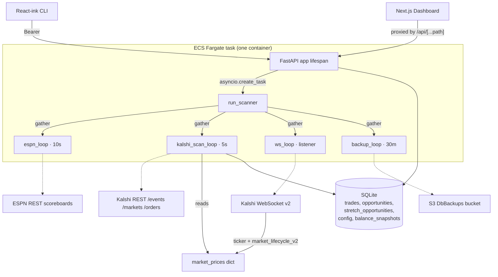
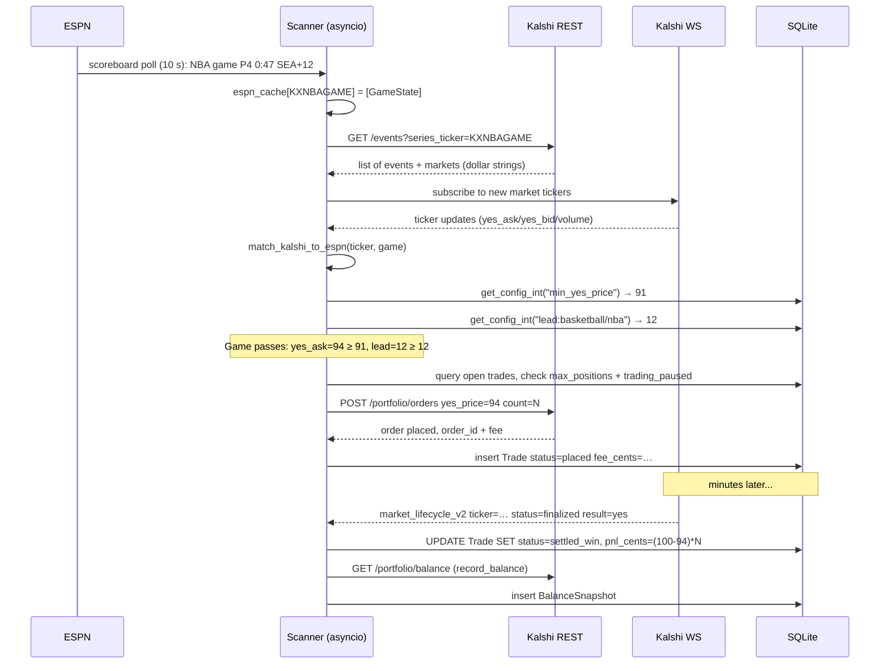

# Kalshi Trading Scanner — Project Reference

> This is the single-source-of-truth architecture snapshot. CLAUDE.md `@`-imports
> this file so it's loaded into every Claude session automatically.

## Summary

A Python + TypeScript system that scans [Kalshi](https://kalshi.com) sports prediction markets, cross-references ESPN live scores, and buys YES contracts at 88–99¢ on games that are already effectively decided. Each settled YES contract pays $1, so the edge comes from the lag between real game state and market re-pricing.

Runs as a single FastAPI process (the scanner is an `asyncio` task inside the API lifespan) deployed on AWS ECS Fargate via SST. A read-only Next.js dashboard and a React-ink CLI consume the API over HTTPS with Bearer auth.

**Key invariants** — understand these before editing code:

- **Integer cents everywhere internally.** Prices are stored in the DB and passed between modules as integer cents (0–100). Kalshi REST v3.10 returns dollar strings (`"0.9200"`); `extract_cents()` in `kalshi_client.py` is the single drift point that normalises both old integer fields and new dollar-string fields. Do NOT introduce parallel conversion paths.
- **Orders require integer cents.** `POST /portfolio/orders` still takes `yes_price: int` despite the read side being strings. Don't convert both endpoints to the same format.
- **Runtime config is re-read every scan loop (~5 s).** Config lives in the SQLite `config` table with defaults in `db._CONFIG_DEFAULTS`. Never hardcode tunables — call `get_config_int("key")`.
- **`trading_paused == "true"`** is the kill switch. Checked every loop before placing bets.
- **DRY_RUN** controls real vs shadow order placement at process start (not runtime). Real trades are `dry_run=False`; simulated ones get status `"dry_run"`.
- **`StretchOpportunity`** rows are shadow/what-if bets under 5 parallel strategies (defined in `scanner.WHAT_IF_STRATEGIES`) plus a "default" near-miss bucket. Same schema as `Opportunity` plus `strategy_set` and hypothetical P&L. Continuously backtests parameter relaxations on live data.
- **WS is primary, REST is backup for settlements.** `market_lifecycle_v2` handler in `scanner.run_scanner` fires first; `check_settlements()` and `check_stretch_settlements()` are the reconciliation fallback run every scan loop.

## Project Structure

```
kalshi-trading/
├── CLAUDE.md                   Rules + @docs/project.md import for Claude sessions.
├── Dockerfile                  Python 3.13 slim + uv; two-step install (deps, then pkg).
├── LICENSE                     Project license.
├── README.md                   User-facing docs (install, usage, deployment).
├── install.sh                  One-command bootstrap (prereqs, uv sync, pnpm i, .env, hook).
├── .env.example                Canonical env schema (copy to .env locally).
├── .gitignore                  Python caches, node_modules, SST, DB, logs, .env*.
├── package.json                Root pnpm scripts (dev, sst:deploy, cli, lint, pre-commit-check).
├── pnpm-workspace.yaml         Declares cli/ + dashboard/ as workspace packages.
├── pnpm-lock.yaml              Lockfile.
├── pyproject.toml              Python deps + ruff/ty config + hatchling src-layout build.
├── uv.lock                     uv lockfile.
├── sst.config.ts               SST infra: VPC, ECS, S3, Cloudflare DNS, secrets.
├── sst-env.d.ts                SST-generated TS types (regenerated by `sst dev/deploy`).
├── docs/
│   └── project.md              This file — architecture + data flow + invariants.
├── scripts/
│   └── pre-commit-check.sh     Runs ruff format + check + ty on staged src/tests; oxfmt on dashboard.
├── src/predictions/
│   ├── __init__.py             Package marker; exports __version__.
│   ├── api.py                  FastAPI app + all Bearer-protected endpoints; spawns scanner task.
│   ├── scanner.py              Four async loops (ESPN 10s, Kalshi 5s, WS, S3 backup 30m) + WHAT_IF_STRATEGIES.
│   ├── db.py                   SQLAlchemy models; inline ALTER-TABLE migrations; KV config helpers.
│   ├── espn.py                 ESPN scoreboard client; Kalshi↔ESPN team-abbrev matching.
│   ├── kalshi_client.py        Async REST + WebSocket auth (RSA-signed); extract_cents / extract_volume.
│   └── config_cli.py           Local CLI for direct DB config view/set/delete/reset.
├── tests/
│   ├── test_sport_stats.py     Standalone script exercising per-sport stats aggregation.
│   └── test_ws.py              Standalone script connecting to Kalshi WS.
├── cli/
│   ├── package.json            React-ink TUI workspace; calls the API with Bearer auth.
│   ├── tsconfig.json
│   └── src/
│       ├── index.tsx           Entry point; meow arg parsing; JSON vs TUI mode.
│       ├── app.tsx             Router between config/stats/trades views.
│       ├── api.ts              Typed fetch wrapper for the backend.
│       └── components/
│           ├── config.tsx      ConfigView + ConfigSet ink components.
│           ├── stats.tsx       Stats panel.
│           └── trades.tsx      Recent-trades list.
├── dashboard/                  Next.js 16 read-only dashboard.
│   ├── package.json
│   ├── next.config.ts
│   ├── tsconfig.json
│   ├── oxfmt.json / oxlint.json
│   ├── postcss.config.mjs
│   └── app/
│       ├── layout.tsx          Root layout with Geist fonts.
│       ├── page.tsx            Full SPA (auth, fetch, charts, tables) — 102 KB monolith.
│       ├── actions.ts          Server actions for login, checkAuth, updateConfig.
│       ├── icon.tsx / opengraph-image.tsx / twitter-image.tsx   Branding assets.
│       ├── globals.css         Tailwind entry.
│       ├── robots.txt/route.ts
│       └── api/[...path]/route.ts   Proxies client fetches to backend, injects Bearer.
└── images/                     Static project images referenced from README.
```

## Code Architecture



**Process shape.** `api.py` declares an async `lifespan` that downloads the latest DB from S3, runs `init_db()`, constructs a `KalshiClient`, and spawns `run_scanner()` as an `asyncio` task. The FastAPI app keeps serving HTTP requests while the scanner runs four `asyncio.gather`-ed loops in the same event loop, sharing a module-level `market_prices` dict and a SQLAlchemy session factory.

**Settlement duality.** A market can settle via two paths:
1. **WebSocket** (`on_lifecycle` handler in `scanner.run_scanner`) — fast, fires when Kalshi emits `market_lifecycle_v2`.
2. **REST poll** (`check_settlements`, `check_stretch_settlements`) — runs every scan loop iteration as a backstop if the WS missed an event.

These two paths compute P&L slightly differently — see "Known issues" below.

**Auth.** Every mutating or data-reading endpoint requires a Bearer token (`Depends(_check_token)`) matched against `os.getenv("API_TOKEN")`. The dashboard doesn't expose this token to the browser — it calls its own `/api/[...path]/route.ts` server-side proxy which injects the token. The CLI holds the token in memory from `API_TOKEN` env or `--token`.

## Trading Data Flow



## Known Issues

These are documented here rather than fixed so follow-up sessions can pick them up:

- **Fee-accounting mismatch between settlement paths.** `scanner.check_settlements` subtracts `fee_cents` from P&L on win; the WebSocket lifecycle handler (`on_lifecycle` in `run_scanner`) sets `pnl_cents = potential_profit_cents` without subtracting the fee. WS fires first in production, so real-trade P&L is systematically overstated by the fee amount.
- **$200 hardcoded starting-balance assumption in `/api/stats`.** `api.get_stats` computes historical unrecorded fees as `total_pnl - (balance_cents - 20000)`, baking in a $200 starting balance. Breaks for any other starting balance or if deposits/withdrawals occurred.
- **SQLite durability window** — production DATABASE_URL is `/tmp/predictions.db` (ECS task-local, lost on restart). Durability is actually "S3 snapshot every 30 min + `_download_db()` in lifespan startup". Data loss window up to 30 min on a crash. No EFS is mounted despite older docs claiming otherwise.
- **`dashboard/app/page.tsx` is a single 102 KB `"use client"` component.** Does auth, all fetching, charts, tables, and UI in one file. Worth breaking up in a dedicated session.
- **No pytest suite.** `tests/test_sport_stats.py` and `tests/test_ws.py` are standalone `asyncio.run(...)` scripts. A real pytest harness would let the pre-commit hook actually prove things.
- ~~`market_prices` dict race~~ — retracted. On review the iteration site (`scanner.py` inside `_evaluate_what_if_strategies`) already takes a `list(market_prices.items())` snapshot before looping, and the WS handler replaces inner dicts wholesale rather than mutating in place. Combined with asyncio's single-threaded execution, there is no torn-read window.
- **`kalshi_client._rate_limit` imports `asyncio` inside the function** (copy-paste artefact). Cosmetic.
- **Hypothetical stretch P&L assumes 5 contracts** (`scanner.check_stretch_settlements`, WS lifecycle). Doesn't reflect the real `bet_percent`-of-balance sizing, so what-if P&L isn't directly comparable to realised P&L.
- **`trade.side` hardcoded to "yes" in stretch settlement.** All strategies currently bet YES, but any future NO strategy would mis-settle.

## External References

- Kalshi trade API v3.10: `https://trading-api.readme.io/` (price format changed to FixedPointDollars strings in v3; orders still take integer cents).
- ESPN undocumented scoreboards: `https://site.api.espn.com/apis/site/v2/sports/<path>/scoreboard`.
- SST v3 docs: `https://sst.dev/docs`.
